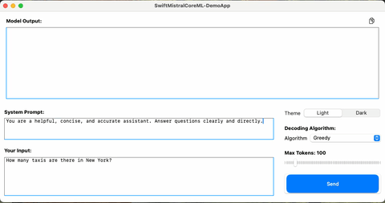

# SwiftMistralCoreML Demo App

A small macOS application demonstrating how to use the [SwiftMistralCoreML](https://github.com/cardona/SwiftMistralCoreML) library for generating conversational AI responses using the Mistral-Interact7B CoreML. This application features a simple user interface built with SwiftUI, allowing users to interact with the model in real-time.





## Features

- **Interactive Chat**: Send input prompts to the model and receive real-time responses.
- **Customizable Parameters**: Adjust system prompt, decoding algorithm, and max tokens to customize the model's output.
- **SwiftUI Integration**: A macOS app built entirely with SwiftUI
- **Theming Support**: Includes a Light and Dark mode for user convenience.
- **Multiple Decoding Strategies**: Supports Greedy and Top-K sampling algorithms.

## Prerequisites

To use this demo app, you need to set up the Mistral-Interact7B CoreML model:

1. **Download the Model**: The Mistral-Interact7B INT4 CoreML model is available on [Hugging Face](https://huggingface.co/apple/mistral-coreml). Download the `.mlmodel` file.
2. **Add the Model to the Project**: Drag and drop the `.mlmodel` file into your Xcode project to enable the app to use it.

## Important Note

- **First-Time Model Execution**: Please note that the first execution of the CoreML model may take significantly longer. This delay occurs because the model needs to be initialized and optimized for your system.

## Installation

To run the demo app locally, follow these steps:

1. Clone this repository:
   ```sh
   git clone https://github.com/cardona/SwiftMistralCoreML-DemoApp.git
   ```
2. Open the project in Xcode.
3. Make sure to add the `.mlmodel` file from Hugging Face.
4. Run the app on your macOS device.

## Usage

1. **System Prompt**: Use the **System Prompt** text area to define the assistant's behavior. For example: "You are a helpful, concise, and accurate assistant."
2. **User Input**: Type your question or command into the **Your Input** text area.
3. **Decoding Algorithm**: Select the decoding algorithm (Greedy or Top-K) to control how the model generates responses.
   - **Greedy**: Picks the token with the highest probability.
   - **Top-K**: Samples from the top K most probable tokens, allowing for more varied responses.
4. **Max Tokens**: Use the slider to define the maximum number of tokens to generate.


## Decoding Algorithms

This demo app allows you to experiment with different decoding algorithms:

- **Greedy Decoding**: Selects the highest-probability token at each step.
- **Top-K Sampling**: Samples from the top K tokens, providing a balance between randomness and accuracy.

Select the desired algorithm in the **Decoding Algorithm** section to see how the model's responses change.

## Theming

You can toggle between **Light** and **Dark** themes by selecting the preferred theme from the **Theme** section in the controls.

## Future Plans

- **FP16 Model Support**: In future updates, support for FP16 models will be added to improve performance.
- **Extended Compatibility**: Ensuring compatibility with upcoming iOS versions to extend functionality to iPhone devices.
- **New Decoding Strategies**: Planned support for additional decoding strategies like Beam Search and Temperature Sampling.

## Known Limitations

- **First Run Performance**: As mentioned, the first execution of the model takes longer due to initialization requirements.
- **macOS Only**: Currently, the app is only available for macOS. Plans to extend support to iOS in the future are underway.

## Customization

Feel free to extend or modify the app to suit your needs. The underlying [SwiftMistralCoreML](https://github.com/cardona/SwiftMistralCoreML) library is designed to be flexible, and you can replace or add components like different decoding strategies or change the interaction flow.

## Contributing

Contributions are welcome! If you have ideas for improvements or additional features, please open an issue or submit a pull request on the [GitHub repository](https://github.com/cardona/SwiftMistralCoreML-DemoApp).

## License

This project is licensed under the MIT License.

---

*This demo app showcases the capabilities of [SwiftMistralCoreML](https://github.com/cardona/SwiftMistralCoreML) by providing a simple and interactive way to experience conversational AI on macOS.*